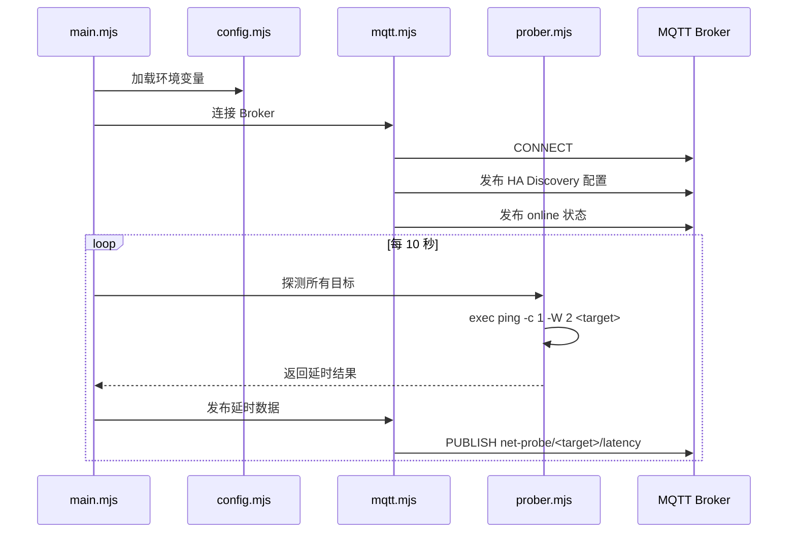

# Net Probe MQTT - 系统架构文档

## 项目概述

一个基于 Node.js 的网络延时探测工具，通过系统 `ping` 命令探测多个目标主机的网络延时，并将结果发布到 MQTT broker，支持 Home Assistant MQTT Discovery 自动集成。

## 技术栈

| 组件 | 技术选型 | 说明 |
|------|----------|------|
| 运行时 | Node.js 20 LTS | ESM 模块 (.mjs) |
| MQTT 客户端 | mqtt.js | npm 官方推荐库 |
| Docker 基础镜像 | node:20-alpine | 轻量级，需安装 iputils |
| 探测方式 | 系统 ping 命令 | 通过 child_process.exec 调用 |

---

## 系统架构

```
┌─────────────────────────────────────────────────────────────┐
│                    Docker Container                          │
│  ┌─────────────────────────────────────────────────────────┐│
│  │                     main.mjs                             ││
│  │  ┌──────────┐  ┌──────────┐  ┌────────────────────────┐ ││
│  │  │ Prober   │──│ Scheduler│──│ MQTT Publisher         │ ││
│  │  │ Module   │  │ (10s)    │  │ + HA Discovery         │ ││
│  │  └──────────┘  └──────────┘  └────────────────────────┘ ││
│  └─────────────────────────────────────────────────────────┘│
│                           │                                  │
│                    ping command                              │
│                    (iputils)                                 │
└─────────────────────────────────────────────────────────────┘
                            │
                            ▼ MQTT
              ┌─────────────────────────────┐
              │   Mosquitto Broker (HA)     │
              └─────────────────────────────┘
                            │
                            ▼
              ┌─────────────────────────────┐
              │      Home Assistant         │
              │   (Auto-discovered Sensors) │
              └─────────────────────────────┘
```

---

## 探测目标配置

通过环境变量 `PROBE_TARGETS` 传入 JSON 格式的探测目标列表：

| 目标 | ID (Topic用) | 名称 (HA显示) |
|------|--------------|---------------|
| `223.5.5.5` | `dns` | DNS延时 |
| `baidu.com` | `china` | 国内站点连通性 |
| `github.com` | `github` | 国际直连连通性 |
| `x.com` | `global` | 国际站点连通性 |

**ENV 格式:**
```bash
PROBE_TARGETS='[{"host":"223.5.5.5","id":"dns","name":"DNS延时"},{"host":"baidu.com","id":"china","name":"国内站点连通性"},{"host":"github.com","id":"github","name":"国际直连连通性"},{"host":"x.com","id":"global","name":"国际站点连通性"}]'
```

---

## 环境变量配置

| 变量名 | 必填 | 默认值 | 说明 |
|--------|------|--------|------|
| `MQTT_HOST` | ✅ | - | MQTT Broker 地址 |
| `MQTT_PORT` | ❌ | `1883` | MQTT 端口 |
| `MQTT_USERNAME` | ❌ | - | 用户名（可选认证） |
| `MQTT_PASSWORD` | ❌ | - | 密码（可选认证） |
| `MQTT_TLS` | ❌ | `false` | 是否启用 TLS (`true`/`false`) |
| `PROBE_TARGETS` | ❌ | 见上方默认配置 | JSON 格式的探测目标列表 |

---

## MQTT Topic 设计

### 状态发布

每个探测目标独立 topic，使用英文 ID，payload 仅为延时数值：

```
net-probe/<id>  →  延时(ms) 或 -1(失败)
```

示例：
- `net-probe/dns` → `12.5`
- `net-probe/china` → `25.3`
- `net-probe/github` → `-1`
- `net-probe/global` → `18.7`

### Home Assistant Discovery

每个目标自动注册为传感器，使用中文名称显示：

**Discovery Topic:**
```
homeassistant/sensor/net_probe_<id>/config
```

**示例 (github):**
```json
{
  "name": "国际直连连通性",
  "unique_id": "net_probe_github",
  "state_topic": "net-probe/github",
  "unit_of_measurement": "ms",
  "device_class": "duration",
  "icon": "mdi:network-ping",
  "device": {
    "identifiers": ["net_probe_mqtt"],
    "name": "网络探测",
    "manufacturer": "Custom",
    "model": "Net Probe MQTT"
  }
}
```

---

## Ping 命令参数

```bash
ping -c 1 -W 2 <target>
```

| 参数 | 值 | 说明 |
|------|-----|------|
| `-c` | 1 | 发送 1 个包 |
| `-W` | 2 | 超时 2 秒 |

### 关于 DNS 缓存

- 对于域名目标 (`baidu.com`, `github.com`, `x.com`)，Alpine Linux 默认不启用系统级 DNS 缓存
- 每次 ping 都会触发新的 DNS 解析
- 如需更严格控制，可考虑使用 `dns.resolve4()` 预解析

---

## Docker 配置

### Dockerfile 要点

```dockerfile
FROM node:20-alpine

# 安装 ping 命令
RUN apk add --no-cache iputils

# 创建非 root 用户
RUN addgroup -g 1000 appgroup && \
    adduser -u 1000 -G appgroup -s /bin/sh -D appuser

WORKDIR /app
COPY package*.json ./
RUN npm ci --only=production
COPY . .

USER appuser
CMD ["node", "main.mjs"]
```

### 多平台构建

支持 `linux/amd64` 和 `linux/arm64`：

```bash
docker buildx build --platform linux/amd64,linux/arm64 -t net-probe-mqtt .
```

---

## 模块结构

```
net-probe-mqtt/
├── main.mjs              # 入口文件，主循环
├── src/
│   ├── config.mjs        # 配置加载与验证
│   ├── prober.mjs        # Ping 探测逻辑
│   └── mqtt.mjs          # MQTT 连接与发布
├── Dockerfile
├── docker-compose.yml    # 可选，便于部署
├── package.json
└── README.md
```

---

## 运行流程



---

## 错误处理

| 场景 | 处理方式 |
|------|----------|
| Ping 超时 | 发布 `-1` |
| Ping 失败（目标不可达） | 发布 `-1` |
| MQTT 连接断开 | 自动重连（mqtt.js 默认行为） |
| 启动时 MQTT 连接失败 | 等待重连，不退出进程 |

---

## 安全考虑

1. **非 root 运行**: 使用 `USER appuser` 运行应用
2. **最小权限**: 仅安装必要的 `iputils` 包
3. **敏感信息**: MQTT 密码通过环境变量传入，不硬编码
