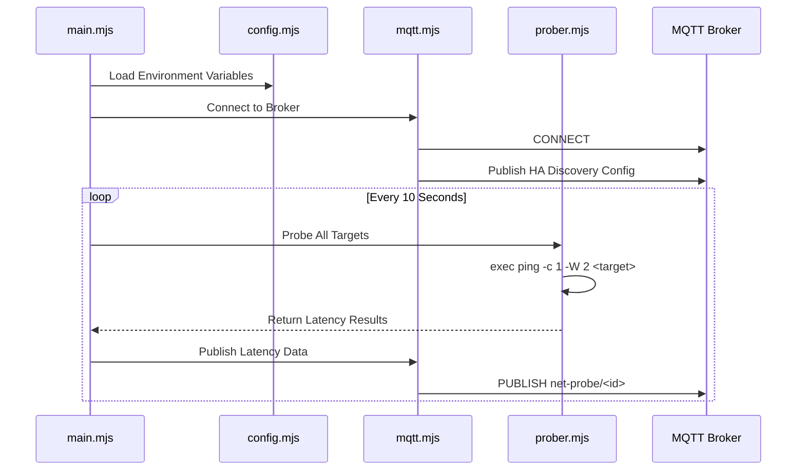

# Net Probe MQTT - System Architecture

## Overview

A network latency probing tool based on Node.js. It uses the system `ping` command to measure network latency to multiple target hosts and publishes the results to an MQTT broker. It supports automatic integration with Home Assistant via MQTT Discovery.

## Technology Stack

| Component | Selection | Description |
|-----------|-----------|-------------|
| Runtime | Node.js 20 LTS | ESM Modules (.mjs) |
| MQTT Client | mqtt.js | Official npm package |
| Base Image | node:20-alpine | Lightweight, `iputils` installed |
| Probing | System ping | via `child_process.exec` |

---

## System Architecture



---

## Configuration

### Probe Targets

Configured via the `PROBE_TARGETS` environment variable as a JSON string.

**JSON Object Structure:**
- `host`: The hostname or IP to ping.
- `id`: Unique English identifier used for the MQTT topic.
- `name`: Human-readable name (supports Chinese) for Home Assistant display.

**Example:**
```json
[
  {"host":"223.5.5.5", "id":"dns", "name":"DNS延时"},
  {"host":"baidu.com", "id":"china", "name":"国内站点连通性"},
  {"host":"github.com", "id":"github", "name":"国际直连连通性"},
  {"host":"x.com", "id":"global", "name":"国际站点连通性"}
]
```

### Environment Variables

| Variable | Required | Default | Description |
|----------|----------|---------|-------------|
| `MQTT_HOST` | Yes | - | MQTT Broker Address |
| `MQTT_PORT` | No | `1883` | MQTT Port |
| `MQTT_USERNAME` | No | - | Username (Optional) |
| `MQTT_PASSWORD` | No | - | Password (Optional) |
| `MQTT_TLS` | No | `false` | Enable TLS (`true`/`false`) |
| `PROBE_TARGETS` | No | (Defaults) | JSON list of targets |

---

## MQTT Topic Design

### State Updates

Each target publishes to a separate topic based on its `id`.
Payload is the latency in milliseconds (`ms`) or `-1` if the ping failed/timed out.

**Topic Format:**
```
net-probe/<id>
```

**Examples:**
- `net-probe/dns` -> `12.5`
- `net-probe/china` -> `25.3`
- `net-probe/github` -> `-1`

### Home Assistant Discovery

Sensors are automatically registered in Home Assistant.

**Discovery Topic:**
```
homeassistant/sensor/net_probe_<id>/config
```

**Payload Example:**
```json
{
  "name": "国际直连连通性",
  "unique_id": "net_probe_github",
  "state_topic": "net-probe/github",
  "unit_of_measurement": "ms",
  "device_class": "duration",
  "icon": "mdi:network-ping",
  "device": {
    "identifiers": ["net_probe_mqtt"],
    "name": "网络探测",
    "manufacturer": "Github:skyboooox",
    "model": "Net Probe MQTT"
  }
}
```

---

## Implementation Details

### Ping Strategy
- **Command**: `ping -c 1 -W 2 <host>` (Linux)
- **Timeout**: 2 seconds
- **Packet Count**: 1 per cycle
- **Interval**: 10 seconds
- **DNS**: Relies on system resolution (Alpine Linux default behavior, typically no caching)

### Docker
- **Base**: Alpine Linux
- **User**: Runs as non-root user `appuser` (UID 1000)
- **Architecture**: Multi-platform support (`linux/amd64`, `linux/arm64`)
- **Dependencies**: Installs `iputils` for the `ping` binary

### Error Handling
- **MQTT Disconnect**: Auto-reconnect enabled.
- **Ping Timeout/Fail**: Returns `-1`.
- **Startup**: Retries MQTT connection if broker is unavailable.
- **Shutdown**: Graceful shutdown on `SIGINT`/`SIGTERM`, closes MQTT connection.
